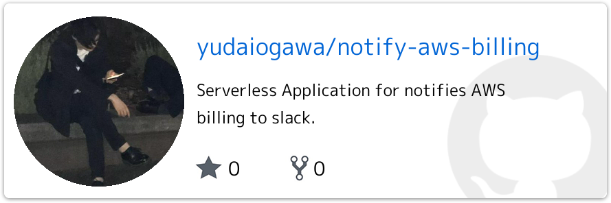
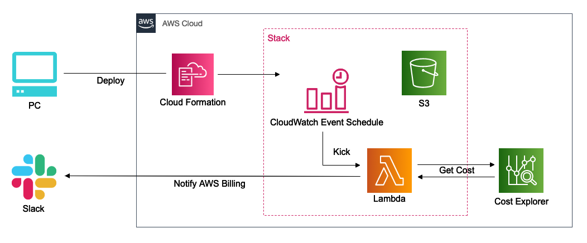
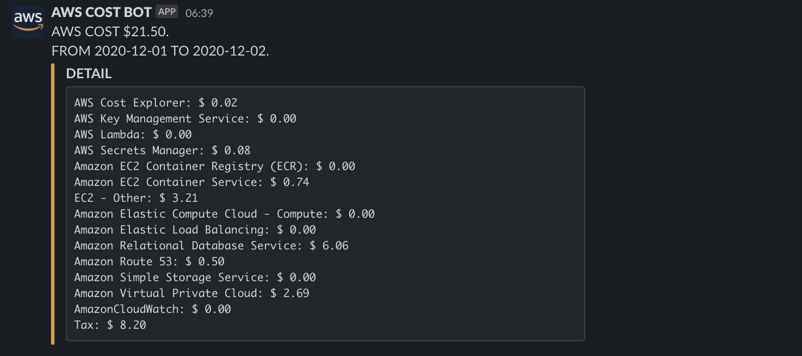

## はじめに

皆さま。ごきげんよう。
僕が愛して止まないデヴィ夫人の冒頭挨拶から本記事はスタートすることにします。

タイトルが「見たらわかる失礼なやつやん」で大変申し訳ないと思っております。よくあるただの煽り文句を使いました。
僕も最近までサーバーレス知りませんでした。

## Serverless とは

サーバー管理が不要なアーキテクチャです。

自前でサーバーを用意/管理するとなると様々な課題と向き合うかと思います。例えば、OS設定や容量管理、負荷管理、ランニングコスト、アイドル時のリソース管理、アクセス制御、セキュリティ管理などキリないですが、サーバーレスアーキテクチャを利用することで、そんなものは気にしなくて良くなり、プログラムロジック（本質）の開発に注力することができるかと思います。熱盛ですね。

現代では、モノリシックよりもマイクロサービスなどの疎結合な特性を持つアーキテクチャが注目されていると思いますが、その一部として、サーバーレスアーキテクチャを導入するという形も考えられると思います。


## [Serverless Framework](https://www.serverless.com/) とは

サーバーレスアーキテクチャを簡単に構築するためのオープンソースフレームワークです。AWSやGCP、他にも様々なクラウドプラットフォームに対応しています。似たものとして、SAM（~~いや EZ DO DANCE じゃないです~~）というAWS公式が提供しているフレームワークもあります。サーバーレス環境をどうやって管理するかという話になった時に使います。

フレームワークを使用せず、AWS上にサーバーレス環境を作るとなると、なかなか大変かと思います。今回であれば、AWS Lambda、CloudWatch Events、S3など手で用意したりすることになり、ある程度の知識も必要になると思いますが、フレームワークを使用することで、設定ファイル1つ、コマンド1発でサーバーレス環境を自動構築してくれちゃいます！！設定ファイルなどを見るだけで、現在の環境を簡単に把握することが出来るって良いですよね。いわゆる `IaC` です。美しい！

> zero-friction serverless development

と公式にあります。このストレス社会の中で、ノンストレスなサーバーレス開発をしよう的な意味でしょうか。感無量。脱帽です。

やっちゃえ SERVERLESS :angel_tone2:


## AWS Lambda とは

`Faas` であり、AWS上のサーバーレスサービスの代表格。フルマネージドで、インフラは管理する必要がなく、コードさえあれば実行可能。スケーラビリティが高く、リクエストに応じて、AWSがリソースを柔軟に確保（スケール）してくれます。`S3`、`SES`、`CloudWatch Events` 等のAWSリソースを活用しており、イベントが発生した時に何かを実行させたりすることができます。ユースケースとしては、定期的なタスクやインベント処理、例えば「S3にファイルが追加されたら〇〇する」、「メールが届いたら△△する」とか「定期的に☆☆通知をSNSにアップ」とかでしょうか。

事実的にはサーバーが存在するのですが、AWS Lambdaではプログラムが実行される際、`lambdaコンテナ` というものが一時作成され、プログラムの実行が終わると無くなるようでして、この部分がサーバーレスと言われる所以みたいです。

クラウド依存ですので、特定の書式で実装する必要があったり、使用可能な言語、メモリ、実行時間等に制限があったりと、制約はありますが、うまく付き合いながらツールを使いこなせれば、使える場面は多岐にわたると思います。

凄くザックリとした説明ですが、凄く便利そうですよね。簡単なAPIとかなら、わざわざEC2とか用意せずにLambdaでイケる！ :)


## 実際に作ったやつ

ソースは以下。Docker環境用意してあるので、ぜひ試してみてください。欲を言えば「PR欲しい :flushed:」。

<a href='https://github.com/yudaiogawa/notify-aws-billing'></a>

#### 全体イメージ図



#### 概要

Cronによりスケジュールされた `CloudWatch Events` をトリガーに `Lambda Function` が実行されます。`Lambda Function` は `CostExplorer` からコストを取得し、Slackに通知するというプログラムになってます。

#### 内容

以下のように通知されます（2020年12月3日の実行イメージ）。



「実行月の1日から昨日までの料金」と「サービス毎の料金（内訳）」をSlackに通知します。毎月1日には「前月の料金」が通知され、料金が0の場合（ほぼ無いけど）は、内訳が通知されないようにしてます。

ローカルのターミナル上で実行したり、ローカルからデプロイされた関数を呼び出すことが可能です。`個人のWEBHOOK_URL` 等を指定して実行を行い、通知確認したり、Slack上での表示を確認したり等が比較的簡単に行えるように工夫しているつもりです。

まだまだ改良の余地があるので、引き続き育てていこうと思います。

#### デプロイ

デプロイは以下コマンド1発。`CloudFormation` 経由で `Stack` および `CloudWatch Events` 、`Lambda` が作成され、ソースは `S3` に格納されます。そう。コマンド1発で。

```zsh
% sls deploy --aws-profile foo --url https://hooks.slack.com/services/T00/B00/XXX
```

#### Docker環境

[lambci/lambda](https://hub.docker.com/r/lambci/lambda/) をイメージを使用しています。`AWS Lambda` の環境を実現しているよう（完全再現では無いようなので注意が必要）でして、良さそうだなと思って使用させてもらっています。


## おわりに

ホント世の中には素晴らしく便利かつアメイジングでクレイジーなツールがあるものですよね。日々の情報収集って物凄く大事だなぁと。僕が触り始めた時には、既に沢山の情報がWEBに溢れていましたし、数年前の情報も沢山。キャッチアップしすぎ/するだけなのはアレですが、知らないのとでは大きく差が出ると思いますし、生産性にも大きく関わってくると思います。素晴らしいツールをどんどん使い、「巨人の肩に乗る」という感じで、開発効率をあげ、生産性を高められたら今より少しは成長できるのかな。などと、一丁前に語ってますが、正直なところ、振り返って一番に感じることは「よっよよ横文字多いなクソッ！」ということです。

僕はまだまだ「守」で未熟者ですので、いろいろ意見など貰えると嬉しいです。「間違ってるよタコ！」とか「もっとこうしろイカ！」など大歓迎です。


## 本当のおわりに

`選ばれる女におなりなさい`

これは僕が愛して止まないデヴィ夫人の言の葉です。

`選ばれるエンジニアにおなりなさい`

そう語れるような人間になれるよう、これからも邁進していきたいと思いました。話がちょっとホップステップジャンプしましたが、以上です。

本当の最後まで目を通していただきありがとうございました。ポケット、いや、サーバーからきゅんです！
